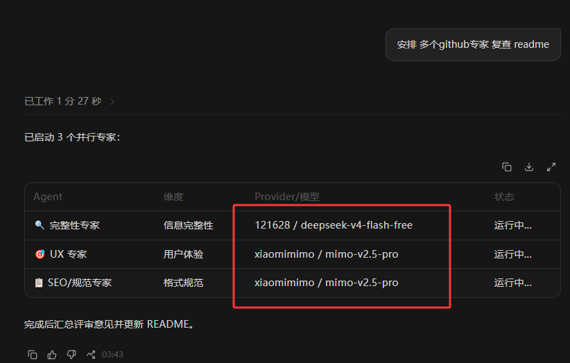
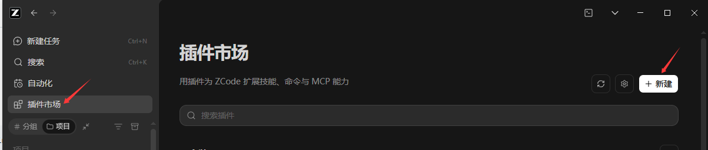
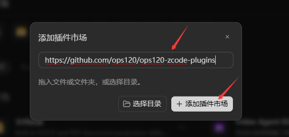
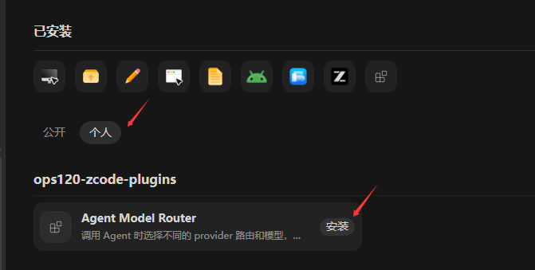
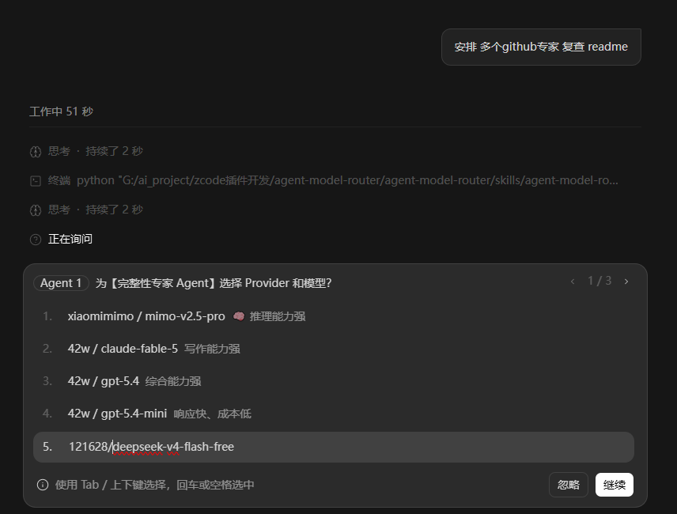
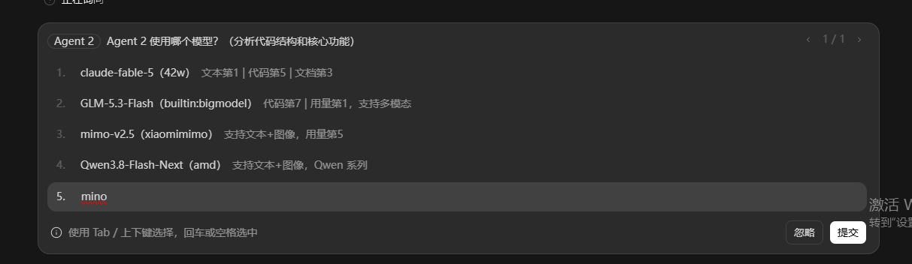
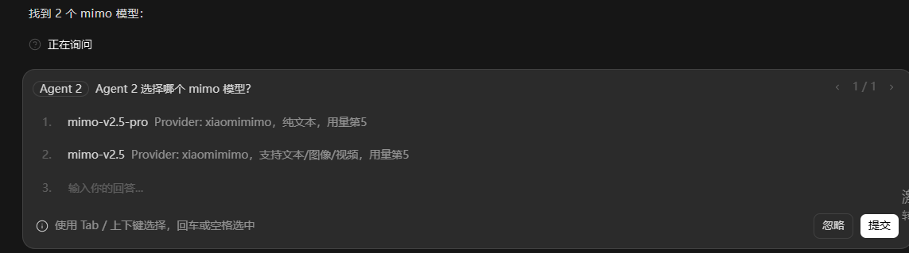
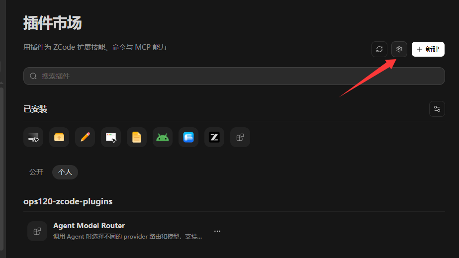
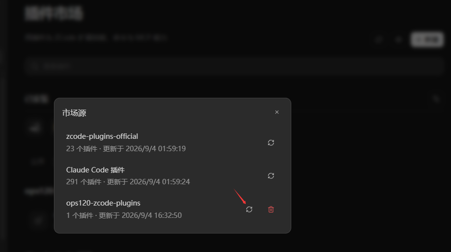
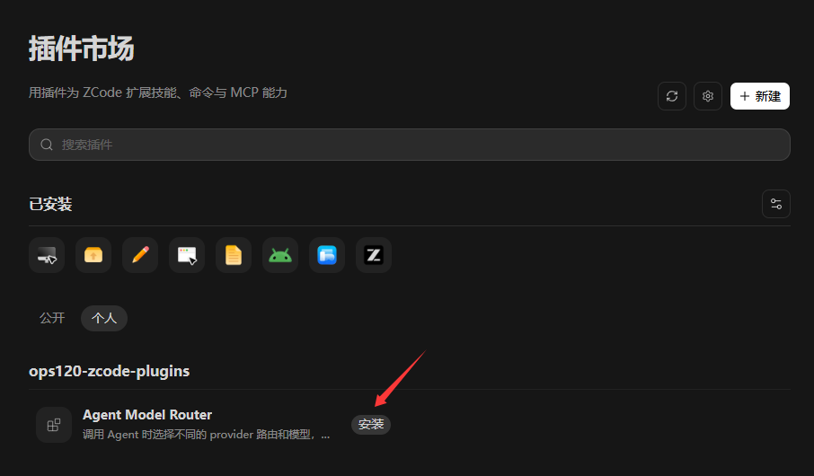

# agent-model-router

> 一个 ZCode 插件，让你在启动多个 AI Agent 时，为每个 Agent 选择不同的模型和 provider。简单任务用小模型省钱，复杂任务用大模型出力。

[](LICENSE)
[](marketplace.json)
[](https://github.com/ops120/ops120-zcode-plugins)



---

## 这个插件解决什么问题？

当你在 ZCode 中启动多个 Agent（子智能体，下文统称"子智能体"）进行并行分析、多维度评估时，默认情况下它们都使用主会话的同一个模型。这个插件改变了这一点：

- **成本优化**：简单任务分配给便宜的小模型，复杂任务交给强大的大模型
- **各取所长**：代码生成用擅长代码的模型，文档撰写用擅长写作的模型
- **灵活切换**：自动读取你已有的 ZCode provider 配置，无需额外设置

## 快速开始

### 前置条件

- ZCode 已安装并正常运行
- ZCode 中至少配置了一个 provider，并填入了对应服务的 API key（如 OpenAI、Anthropic、Google 等）。还没配置？在 ZCode 设置中添加即可——本插件直接读取 ZCode 已有配置，不会自行创建

### 安装（推荐：Git 仓库方式）

1. 打开 ZCode，点击 **创建 > 添加插件市场**

   

2. 选择 **Git 仓库**，粘贴地址：
   ```
   https://github.com/ops120/ops120-zcode-plugins.git
   ```

   

3. 在 **个人** 分类中找到 `agent-model-router`，点击 **安装**

   

4. 新建一个会话

### 安装（备选：本地方式）

```bash
git clone https://github.com/ops120/ops120-zcode-plugins.git
```

然后在 ZCode 中点击 **创建 > 添加插件市场 > 本地目录**，指向克隆的仓库，在 **个人** 分类中安装。

## 使用方式

### 第一步：初始化（首次使用，一次性）

在输入框输入 `/router-setup`，批量为可用的 provider/模型生成子智能体定义（每个模型先经真实请求探测验证）：

```
/router-setup
```

> ⏳ 生成前会对每个模型发送一次真实探测请求（验证可用性），通常需要 **1~2 分钟**，请耐心等待。

执行后会提示「新建会话后生效」。**开一个新会话**即可使用日常功能。

> 后续新增 provider 或模型时，再跑一次 `/router-setup` 即可。

### 第二步：日常使用

在输入框输入 `/agent-model-router` + 任务描述：

```
/agent-model-router 启动多个 agent 来分析这个仓库
```

这是最可靠的方式，不依赖模型"自觉"选技能，harness 会强制加载技能并执行。触发后首先弹出的是交互式选择界面——每个 Agent 提供 4 个候选模型（标注 Provider、排名与用量），也可直接输入关键词搜索，弹窗随即只显示匹配项：







### 完整交互示例

```
你:  /agent-model-router 启动多个 agent 来分析这个仓库

ZCode:  (自动运行 router.py list，获取可用 provider)
        (检测到 ~/.zcode/agents/router-*.md 已存在)
        (弹出选择界面) 请为每个 Agent 选择 provider 和模型:

        Agent 1 - 代码质量分析:
          ○ 42w / claude-fable-5
          ● 121628 / deepseek-v4-flash-free  (你选了这个)
          ○ amd / Qwen3.8-Flash-Next

        Agent 2 - 文档完整性分析:
          ● 42w / gpt-5.4  (你选了这个)
          ○ xiaomimimo / mimo-v2.5-pro

你:   (选择完毕，确认)

ZCode:  直接用已加载的子智能体类型并行启动 2 个 Agent：
        Agent 1 → subagent_type: router-deepseek-v4-flash-free  (运行在 121628 / deepseek-v4-flash-free)
        Agent 2 → subagent_type: router-gpt-5-4                 (运行在 42w / gpt-5.4)

        (2 个 Agent 同时运行，各自返回结果)
```

> ⚠️ **首次使用前必须先执行 `/router-setup`**，否则会提示「尚未生成子智能体定义」。

### 为什么不直接说"启动多个 agent"？

插件也支持自然语言触发（如"启动多个并行 Agent"），但斜杠命令更可靠：

| 方式 | 是否保证触发 | 原因 |
|------|-------------|------|
| `/agent-model-router` | ✅ 是 | harness 强制加载技能，不依赖模型 |
| "启动多个 agent" | ❌ 不一定 | 模型可能跳过技能，自己直接操作 |

### 其他用法

```text
# 列出所有可用的 provider
/agent-model-router 列出可用的 provider

# 搜索特定模型
/agent-model-router 搜索 gemini 相关的模型

# 查看某个 provider 的所有模型
/agent-model-router 查看 OpenAI 有哪些模型
```

> 除了技能本体，插件还注册了一个独立斜杠命令 `/select-provider`（见 `commands/select-provider.md`）：先加载技能，再执行一遍"列出 provider → 弹窗选择 → 按所选模型启动 Agent"的流程，任务描述跟在命令后面即可。两者入口不同，走的是同一条选择流程。

### 命令行方式（进阶）

> 以下内容面向开发者或调试场景，日常使用无需关注。

如果你偏好命令行，可以在技能目录（`skills/agent-model-router/`）下运行 Python 脚本：

```bash
# 为所有已配置模型批量生成子智能体定义（等同于 /router-setup）
# 默认先并发探测每个模型的真实可用性，只给可用模型生成定义
python scripts/router.py setup [--force] [--no-test]

# 单独探测模型可用性（不带参数测全部，也可指定 provider 和模型）
python scripts/router.py test [provider] [model]

# 列出所有 provider
python scripts/router.py list

# 列出某个 provider 的模型（不带参数则列出全部）
python scripts/router.py models [provider]

# 搜索模型
python scripts/router.py search gemini

# 查看模型排行榜（数据来源 arena.ai / openrouter.ai / artificialanalysis.ai）
python scripts/router.py rankings

# 获取指定模型的路由配置
python scripts/router.py get openai gpt-4o

# 以指定格式输出模型信息
python scripts/router.py format openai gpt-4o

# 为指定模型生成子智能体定义（手动补充单个模型时使用）
python scripts/router.py create-agent openai gpt-4o [--name 名称]
# → 生成 ~/.zcode/agents/router-gpt-4o.md，新建会话后生效
```

## 工作原理

```
                    ┌─────────────────────────────────────────┐
                    │  第一步：/router-setup（一次性）         │
                    └─────────────────┬───────────────────────┘
                                      │
                                      v
                    读取 ZCode 配置 (~/.zcode/v2/config.json)
                                      │
                                      v
                    静态过滤：已禁用 / 无 API key 的 provider
                                      │
                                      v
                    并发探测每个模型（真实请求："今天周几"）
                    服务端拒绝（token 失效等）→ 跳过
                                      │
                                      v
                    router.py setup：只为探测通过的模型批量生成子智能体定义
                    (~/.zcode/agents/router-<模型名>.md，frontmatter 的 model 字段绑定该模型)
                                      │
                                      v
                    "新建会话后生效"
                                      │
                    ┌─────────────────┴───────────────────────┐
                    │  第二步：/agent-model-router（日常使用）  │
                    └─────────────────┬───────────────────────┘
                                      │
                                      v
                    主 Agent 检测 router-*.md 已存在
                                      │
                                      v
                    弹出交互式选择界面 (AskUserQuestion)
                                      │
                                      v
                    直接用 subagent_type: router-<模型名> 启动子智能体
                                      │
                                      v
                    ZCode 按定义文件加载模型 → 子智能体真实运行在选定的 provider/模型上
```

### 真实路由，不是提示词安慰

ZCode 的 Agent 工具本身不接受模型参数——在派发提示词里写"本 Agent 使用 XX 模型"不会产生任何效果，子智能体仍会沿用主会话模型（假路由）。

真正的切换点在 ZCode 的**自定义子智能体机制**：`~/.zcode/agents/<name>.md` 定义文件的 frontmatter 支持 `model` 字段，指定后该子智能体固定运行在这个模型上。本插件正是利用这一点：`/router-setup` 批量生成绑定每个模型的子智能体定义，日常使用时主 Agent 以该定义的类型派发任务，模型切换在 ZCode 运行时层面真实生效。

> 生效时机：子智能体定义在会话启动时加载，**新生成的定义需要新建会话**才生效（ZCode 官方行为，已启动的会话不热更新）。所以 `/router-setup` 完成后务必新建会话再使用 `/agent-model-router`。

### Hook 保护：拦截不安全的派发

插件自带一个 PreToolUse Hook（`hooks/hooks.json`，自动发现），每次派发子智能体前检查类型，两种情况会直接拒绝该次调用：

- **使用了内置 Explore 类型**：Explore 不支持模型绑定、也没有 AskUserQuestion 工具，会造成静默假路由且弹框无法出现。Hook 会拒绝并提示改用 `router-*` 类型（尚未生成定义时先执行 `/router-setup` 并新建会话）。
- **调用了刚生成、尚未被 ZCode 加载的 `router-*` 定义**：会话内刚通过 `setup` / `create-agent` 生成的新定义要新建会话才会加载，强行调用会报 "Agent type not found"。插件生成定义时写入标志文件，Hook 据此拦截并提示新建会话；新会话启动时（SessionStart Hook）自动清除标志。

本插件直接读取 ZCode 已有的配置文件 `~/.zcode/v2/config.json`，无需额外的 API key 或配置文件。

## 常见问题

**Q: 安装后没有反应？**
A: 确保新建一个会话。插件安装后需要在新会话中才能生效。

**Q: 更新版本后还是旧版？**
A: ZCode 不会自动覆盖已安装的插件。请先卸载旧版本，再重新安装。详见下方[更新插件](#更新插件)章节。

**Q: 如何确认当前安装的版本？**
A: 在 ZCode 插件市场中点击插件卡片，查看"版本"字段。安装路径在 `高级信息` 中显示。

**Q: 提示找不到 provider？**
A: 请先在 ZCode 设置中配置至少一个 provider（如 OpenAI API key）。本插件读取的是 ZCode 已有的配置，不会自行创建 provider。

**Q: 选好模型后 Agent 还是用的主会话模型，没有切换？**
A: 两种可能：
1. **没有先执行 `/router-setup`**：首次使用前必须先执行 `/router-setup` 生成子智能体定义，否则没有 `router-*` 类型可用。
2. **在生成定义的同一会话中使用**：子智能体定义在会话启动时加载，新建的定义需要**新建会话**才生效。退出当前会话、开一个新会话后再次执行即可。

**Q: 新增了 provider 或模型后怎么办？**
A: 重新执行 `/router-setup`，它会为所有已配置模型重新生成定义。完成后新建会话即可使用新模型。

**Q: 为什么选择界面里没有某个模型（比如 GLM）？**
A: `/router-setup` 生成定义前会对每个模型发送真实探测请求，探测失败的（认证失效、服务端故障等）会被跳过，不会生成对应定义。先在该 provider 的设置里修复认证/状态，再重跑 `/router-setup` 即可。另外，你自己手写的同名 `router-*.md`（不含插件指纹）插件不会覆盖也不会清理。

**Q: 在提示词里写"本 Agent 使用 XX 模型"有用吗？**
A: 没用，文字描述不会让 ZCode 切换模型。必须通过 `router-*.md` 定义文件绑定 `model` 字段并以该 `subagent_type` 启动才真实生效，原理见[真实路由，不是提示词安慰](#真实路由不是提示词安慰)。

**Q: 我可以同时安装多个插件吗？**
A: 可以。本仓库是一个插件市场，后续会添加更多插件。每个插件独立安装，互不影响。

**Q: 免费模型也能用吗？**
A: 能。插件只负责把任务路由到你已配置的 provider/模型上，模型免费还是付费对流程没有影响。

**Q: macOS / Linux 上怎么完全卸载？**
A: 清理步骤与 Windows 相同（见下方[完全卸载](#完全卸载)），命令行部分用 bash 版本即可。

---

## 更新插件

ZCode 会缓存市场清单，更新插件需要先刷新市场缓存，再检查更新：

### 步骤一：刷新市场缓存

打开 ZCode → 插件市场 → 点击右上角 **齿轮图标** → 选择 **刷新该市场**



### 步骤二：检查更新

在 **管理已安装** 页面，点击右上角 **检查更新**



### 步骤三：安装新版本

检测到新版本后，点击插件条目进行更新



> ⚠️ **重要**：如果跳过"刷新市场缓存"直接检查更新，ZCode 会使用旧的缓存数据，导致检测不到新版本。

---

## 完全卸载

ZCode 的插件市场数据分散在五个位置，只清其中一个不够，需要全部清除：

### 清除五个位置

**1. 已安装插件缓存**

```
~/.zcode/cli/plugins/cache/ops120-zcode-plugins/
```

删除整个目录。

**2. 市场数据缓存**

```
~/.zcode/cli/plugins/marketplaces/ops120-zcode-plugins/
```

删除整个目录。

**3. 市场注册表**

```
~/.zcode/cli/plugins/known_marketplaces.json
```

编辑此文件，从 `marketplaces` 数组中移除 `id` 为 `"ops120-zcode-plugins"` 的条目。

**4. 路由生成的子智能体定义**

```
~/.zcode/agents/router-*.md
```

⚠️ **只删除内容里含「agent-model-router 生成」字样的文件**——这是本插件生成文件的指纹。`router-` 开头但没有该字样的是你自己或别人手写的自定义子智能体，**不要删**。

**5. 已安装插件注册表**

```
~/.zcode/cli/plugins/installed_plugins.json
```

编辑此文件，从 `plugins` 数组中移除 `id` 为 `"agent-model-router@ops120-zcode-plugins"` 的条目（记录了安装路径、版本与安装时间）。

### 一行命令（Windows PowerShell）

```powershell
Remove-Item -Recurse -Force "$env:USERPROFILE\.zcode\cli\plugins\cache\ops120-zcode-plugins"
Remove-Item -Recurse -Force "$env:USERPROFILE\.zcode\cli\plugins\marketplaces\ops120-zcode-plugins"
# 只删插件生成的定义（含指纹），用户自定义的 router-*.md 不会被碰
Get-ChildItem "$env:USERPROFILE\.zcode\agents\router-*.md" | Where-Object { Select-String -Path $_ -Pattern "agent-model-router 生成" -Quiet } | Remove-Item -Force
$json = Get-Content "$env:USERPROFILE\.zcode\cli\plugins\known_marketplaces.json" -Raw | ConvertFrom-Json
$json.marketplaces = $json.marketplaces | Where-Object { $_.id -ne "ops120-zcode-plugins" }
$json | ConvertTo-Json -Depth 10 | Set-Content "$env:USERPROFILE\.zcode\cli\plugins\known_marketplaces.json"
$reg = Get-Content "$env:USERPROFILE\.zcode\cli\plugins\installed_plugins.json" -Raw | ConvertFrom-Json
$reg.plugins = $reg.plugins | Where-Object { $_.id -ne "agent-model-router@ops120-zcode-plugins" }
$reg | ConvertTo-Json -Depth 10 | Set-Content "$env:USERPROFILE\.zcode\cli\plugins\installed_plugins.json"
```

### 一行命令（macOS / Linux bash）

```bash
rm -rf ~/.zcode/cli/plugins/cache/ops120-zcode-plugins
rm -rf ~/.zcode/cli/plugins/marketplaces/ops120-zcode-plugins
# 只删插件生成的定义（含指纹），用户自定义的 router-*.md 不会被碰
grep -l "agent-model-router 生成" ~/.zcode/agents/router-*.md 2>/dev/null | xargs rm -f
# 剩余两处是 JSON 记录，手动编辑移除对应条目：
#   ~/.zcode/cli/plugins/known_marketplaces.json  → 移除 id 为 "ops120-zcode-plugins" 的条目
#   ~/.zcode/cli/plugins/installed_plugins.json   → 移除 agent-model-router 对应条目
```

### 为什么不能只清缓存？

| 文件 | 作用 | 不清的后果 |
|------|------|-----------|
| `cache/ops120-zcode-plugins/` | 已安装插件的代码 | 插件文件还在，功能残留 |
| `marketplaces/ops120-zcode-plugins/` | 市场的插件列表（marketplace.json） | 插件市场里还能看到 |
| `known_marketplaces.json` | 市场注册表 | 市场本身还显示在列表里 |
| `~/.zcode/agents/router-*.md` | 插件生成的子智能体定义（含指纹「agent-model-router 生成」，清理时按指纹过滤，不碰用户自定义） | 设置 → 子智能体中残留无用条目 |
| `~/.zcode/cli/plugins/installed_plugins.json` | 已安装插件注册表 | 已安装记录中残留条目 |

以上五处是独立存储的，清了第一处只是"没安装"，但市场还在列表里、路由生成的子智能体定义仍在。需要全部清除才能彻底移除。

---

## 贡献指南：开发新插件

如果你想基于本仓库开发新插件：

### 目录结构

```
ops120-zcode-plugins/
├── marketplace.json              # 插件市场配置
├── README.md / CONTRIBUTING.md / LICENSE
├── demo/                         # README 引用的截图
├── agent-model-router/           # 本插件
│   ├── .zcode-plugin/
│   │   └── plugin.json           # 插件清单（名称、版本、组件路径）
│   ├── commands/                 # 斜杠命令
│   │   ├── router-setup.md
│   │   └── select-provider.md
│   ├── hooks/                    # PreToolUse Hook
│   │   ├── hooks.json
│   │   └── check-agent-type.js
│   └── skills/
│       └── agent-model-router/
│           ├── SKILL.md          # 技能主体
│           ├── references/
│           │   └── model-rankings.md
│           └── scripts/
│               ├── router.py     # 路由脚本
│               └── rankings.py   # 排行榜模块
└── your-new-plugin/              # 新插件
    ├── .zcode-plugin/
    │   └── plugin.json
    └── skills/
        └── your-skill/
            └── SKILL.md
```

### 步骤

1. 在仓库根目录创建插件目录
2. 在 `marketplace.json` 的 `plugins` 数组中注册：
   ```json
   { "name": "your-new-plugin", "source": "./your-new-plugin" }
   ```
3. 创建 `plugin.json`：
   ```json
   {
     "name": "your-new-plugin",
     "version": "0.1.0",
     "description": "插件描述",
     "author": { "name": "your-name" },
     "skills": "skills"
   }
   ```
4. 创建 `SKILL.md`：
   ```markdown
   ---
   name: your-skill
   description: 什么时候使用这个技能
   ---
   技能内容
   ```
5. 提交并推送：
   ```bash
   git add .
   git commit -m "feat: 新增 your-new-plugin"
   git push
   ```

用户刷新插件市场即可获取新版本。

## 社区

本项目在 [LINUX DO 社区](https://linux.do) 进行开源推广，感谢社区佬友的交流、反馈与建议。

## 作者

你们喜爱的老王 — [B 站 @你们喜爱的老王](https://space.bilibili.com)<!-- TODO: 补充你的 B 站空间 UID，形如 https://space.bilibili.com/12345678 --> · [GitHub @ops120](https://github.com/ops120)

## License

MIT
